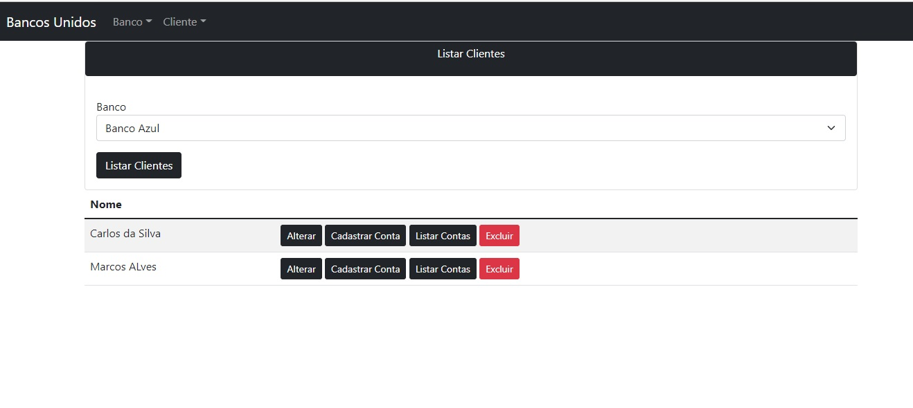
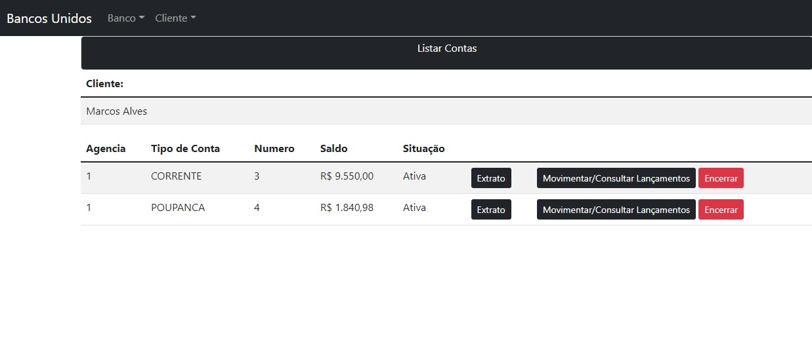
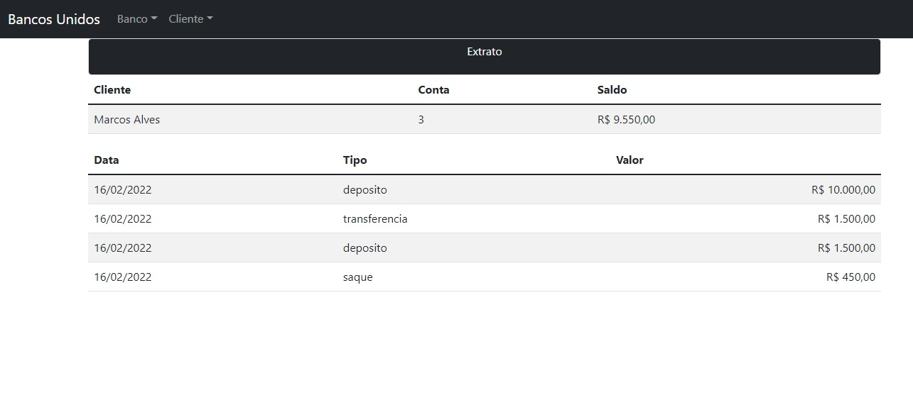

<h1> Banco Digital com Java e Orientação a Objetos </h1>

Este projeto foi desenvolvido em aula proporcionada pela Digital Innovation One, através do desenvolvedor
Venilton FalvoJr.

Foi desenvolvido um projeto bastante simples para permitir a compreensão dos conceitos relacionados a Abstração, Encapsulamento, Herança e Polimorfismo.

Em relação ao projeto desenvolvido em aula, fiz significativas alterações:

- Criei uma ModelAndView utilizando o SpringMvc e o Thymeleaf, para permitir o uso das classes criadas, muito além do simples main com System.out;
- Criei services/repositories para persistir os dados. Utilizei o MySQL;
- Inclusão da classe "lançamentos" para permitir a movimentação das contas;
- Alteração de várias classes para melhor adequar ao uso de banco de dados.

Seguem algumas imagens de como ficaram as views:

Pré-requisitos para a execução do projeto:

- Java 11.
- Maven 3.6.3 ou versões superiores.
- Intellj IDEA Community Edition ou outra IDE.
- Thymeleaf.

